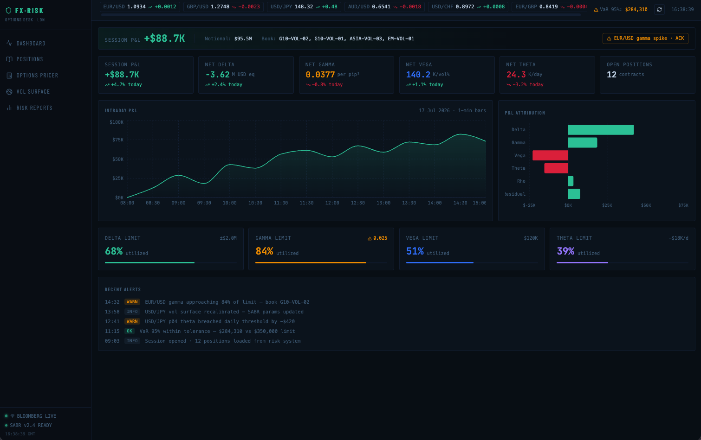

# FX Options Risk Dashboard

A simulated front-office UI/UX case study designed in Figma and implemented with React and TypeScript.

## Links

## FX Options Risk Dashboard v1.0.0

First public release of the dashboard.

### Highlights
- FX option trade form
- Position monitoring
- Delta, Gamma, Vega, Theta metrics
- Scenario analysis
- Responsive and accessible UI

### Links

- Figma prototype: [Figma](https://dazzle-shred-18160730.figma.site)
- Live application: [Realtime Risk Dashboard](https://fx-risk-dashboard.vercel.app/)

### Notes

All market data, positions, and risk calculations are simulated for portfolio and educational purposes.

## Features

- FX option trade form
- Position monitoring
- Delta, Gamma, Vega and Theta metrics
- Scenario analysis
- Responsive layout
- Accessible controls

## Important notice

All market data, positions and risk calculations in this project are simulated for portfolio and educational purposes.

## License

This project is licensed under the MIT License. See [LICENSE](./LICENSE).
